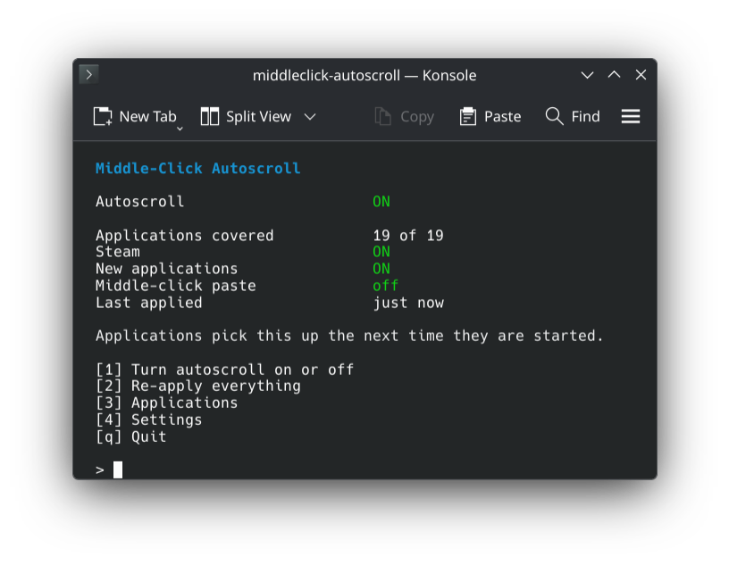
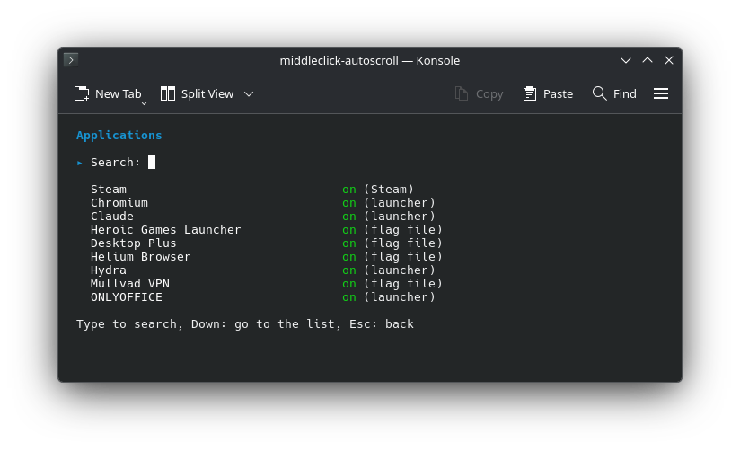

<p align="center">
  
</p>

<h1 align="center">middleclick-autoscroll</h1>

<h3 align="center">Middle-click autoscroll in every app that supports it.</h3>

<p align="center">
  Browsers, Electron apps like Discord and Spotify, Steam and anything else built on Chromium.
</p>

<h5 align="center">
  <a href="#install">Install</a> |
  <a href="#how-to-use">How to use</a> |
  <a href="https://github.com/LoonixTools/middleclick-autoscroll/issues">Report a bug</a>
</h5>

<p align="center">
  <a href="https://buymeacoffee.com/felitendo"></a>
</p>

## Install

<details>
<summary><b>Arch</b></summary>

```bash
yay -S middleclick-autoscroll
```

</details>

<details>
<summary><b>Fedora</b></summary>

```bash
sudo curl -fsSL -o /etc/yum.repos.d/middleclick-autoscroll.repo \
  https://loonixtools.github.io/middleclick-autoscroll/middleclick-autoscroll.repo
sudo dnf install middleclick-autoscroll
```

</details>

<details>
<summary><b>Bazzite</b></summary>

```bash
sudo curl -fsSL -o /etc/yum.repos.d/middleclick-autoscroll.repo \
  https://loonixtools.github.io/middleclick-autoscroll/middleclick-autoscroll.repo
sudo rpm-ostree install middleclick-autoscroll
systemctl reboot
```

</details>

<details>
<summary><b>Debian</b>, Ubuntu</summary>

```bash
sudo install -d -m 0755 /etc/apt/keyrings
curl -fsSL https://loonixtools.github.io/middleclick-autoscroll/KEY.gpg \
  | sudo gpg --dearmor -o /etc/apt/keyrings/middleclick-autoscroll.gpg
echo "deb [signed-by=/etc/apt/keyrings/middleclick-autoscroll.gpg] https://loonixtools.github.io/middleclick-autoscroll/deb ./" \
  | sudo tee /etc/apt/sources.list.d/middleclick-autoscroll.list
sudo apt update && sudo apt install middleclick-autoscroll
```

</details>

<details>
<summary><b>openSUSE</b></summary>

```bash
sudo rpm --import https://loonixtools.github.io/middleclick-autoscroll/KEY.gpg
sudo zypper addrepo --gpgcheck --refresh \
  https://loonixtools.github.io/middleclick-autoscroll/rpm middleclick-autoscroll
sudo zypper install middleclick-autoscroll
```

</details>

## How to use

```bash
middleclick-autoscroll
```

<p align="center">
  
</p>

Press **1**. Autoscroll _✨just works✨_, like on Windows.

<details>
<summary>Applications</summary>

**3** lists every app it found. Space turns one on or off.

<p align="center">
  
</p>

</details>

## More

<details>
<summary>How it works</summary>

Chromium, Electron and CEF all have autoscroll built in, but it is off on Linux. One flag turns it on:

```
--enable-blink-features=MiddleClickAutoscroll
```

Setting that for every app by hand is a pain and breaks with updates, so this tool does it for you.
New apps are picked up on their own. AppImages are covered too, without unpacking or starting them.

Some browsers want a different name. Brave and Helium ship the feature under their own, so browsers
are handed all of the names at once. A name a browser does not know is ignored.

Steam is its own case. It builds the command line for its interface itself, and repairs every file
that looks changed. So the flag goes into the script that starts the web helper, written to keep the
file at the size and date Steam recorded. Steam finds nothing to repair, and autoscroll works in the
store and the library. After a Steam update the patch is put back on its own.

</details>

<details>
<summary>Commands</summary>

| | |
|---|---|
| `middleclick-autoscroll` | The menu |
| `… enable` | Turn on |
| `… disable` | Undo everything |
| `… apply` | Pick up new apps |
| `… status` | What is covered |
| `… list` | All apps and how they are handled |

</details>

<details>
<summary>Build from source</summary>

```bash
make
sudo make install
```

Optional: `msgfmt` for translations, `scdoc` for the man page.

</details>

GPL-3.0-or-later.
